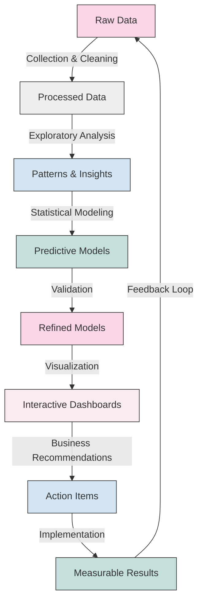

# Shashank S
## Aspiring Data Analyst | Python, SQL, Power BI | Data Visualization | Predictive Modeling | Machine Learning Enthusiast

### About Me
I transform complex datasets into actionable business insights using advanced analytics and visualization techniques. With strong technical skills and business acumen, I help organizations make data-driven decisions that drive growth and efficiency.

---

### Core Expertise
- **Data Analysis & Visualization** → Python, SQL, Power BI, Excel (VLOOKUP, Pivot Tables)
- **Machine Learning** → Predictive Modeling, Classification, Regression Analysis
- **Statistical Analysis** → Hypothesis Testing, Correlation, Data Mining
- **Business Intelligence** → Dashboard Development, KPI Tracking, Reporting Automation

---

### Featured Projects

#### Healthcare Analytics: Predictive Modeling for Diabetes
- Built predictive model with 85% accuracy using Python and Decision Trees
- Processed 1,000+ patient records, reducing false positives by 30%

#### E-Commerce Analytics: Customer Behavior Analysis (Blinkit)
- Analyzed 500+ customer transactions using SQL to optimize inventory
- Created visualization dashboards that improved customer engagement by 15%

#### Financial Services: Customer Churn Prevention
- Developed automated Excel dashboards reducing reporting time by 60%
- Implemented data-driven strategies decreasing churn rate by 20%

---

### Professional Experience

**Machine Learning and AI Development Intern**  
*Karunadu Technologies Private Limited, Bengaluru* | Oct 2023 - Nov 2023
- Enhanced prediction model accuracy by 30% using Python-Django
- Created Power BI dashboards reducing report generation time by 50%

---

### Education & Certifications

**Bachelor of Engineering, Information Science**  
HKBK College of Engineering, Bengaluru | 2023-2025

**Diploma in Tool and Die Making**  
Government Tool Room and Training Centre, Bengaluru | 2019-2022

**Certifications:**
- Machine Learning and AI Development (Karunadu Technologies)
- Data Analysis and Visualization (Accenture)
- Data Analytics and Business Intelligence (Udemy)

---

### Connect With Me

  
  
  

### Languages and Tools

  
  
  
  
  
  
  

### My Data Analysis Workflow

### What Sets Me Apart
<table>
  <tr>
    <td width="50%">
      <h4>🔍 Analytical Mindset</h4>
      
I approach each problem methodically, breaking complex challenges into manageable components to find optimal solutions.

    </td>
    <td width="50%">
      <h4>💡 Business Acumen</h4>
      
I translate technical insights into business value, ensuring analytics drive tangible outcomes and ROI.

    </td>
  </tr>
  <tr>
    <td width="50%">
      <h4>🚀 Continuous Learning</h4>
      
I stay current with emerging technologies and methodologies, constantly expanding my analytical toolkit.

    </td>
    <td width="50%">
      <h4>🤝 Collaborative Approach</h4>
      
I work effectively with cross-functional teams, communicating complex findings in accessible terms.

    </td>
  </tr>
</table>

### Data Analysis Quote

  

> "I turn data into insights, and insights into business value."
